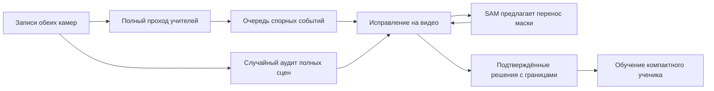

# Исправления на видео, точные визиты и компактная модель

Исследование 18.09.2026. Это проект следующего этапа, а не описание внедрённых функций. Изучены код разметчика и конвейера, сохранённые результаты экспериментов, состояние Windows в 23:36 UTC+7 и первичные публикации. В рамках этого исследования рабочие программы, разметка и обучение не менялись.

Рекомендация: сделать единицей работы человека **ошибку в коротком эпизоде и её границы**. Полный проход учителей остаётся по всему дню и залу. Человек исправляет личность, пропуск или контур прямо на видео; система пересчитывает затронутый интервал и показывает результат. Подтверждённые исправления становятся данными для компактного ученика. SAM 2.1 Large — кандидат для уточнения масок и их переноса во времени. За глобальные личности, связь камер и визиты отвечают отдельные проверяемые решения.

| Что установлено сейчас | Что это означает для следующего этапа |
|---|---|
| Контекстное видео — готовый четырёхсекундный MP4 с нанесённой разметкой одного отрезка (`review_media.py`, `static/review.js`) | Нужен интерактивный слой поверх видео, выбор любого человека и точного исходного кадра |
| Операции разметчика работают с существующими отрезками и индексами детекций (`review_store.py`) | Нельзя добавить полностью пропущенного человека или сохранить исправленную пользователем маску |
| На Windows 336 ручных меток отрезков, отдельных оценок `quality` — 0 | Подтверждение личности нельзя считать независимой проверкой контура; это также не 336 разных посетителей |
| В эксперименте c112000 показатель one-ID вырос до 1,000, а примесь чужих детекций — до 8,75% | Один номер на человека не доказывает отсутствие склеек; нужен эталон полных визитов |
| Маски для обучения пока происходят от учителя; экспорт проверяет полноту относительно его детекций | Полностью пропущенный всеми моделями человек не обнаруживается такой проверкой |
| Два ночных процесса с 21:00 завершили девять десятиминутных окон к 23:31; GPU RTX 3060 12 ГБ загружена на 100% | Перед добавлением большого учителя необходимо измерять отставание и суточную производительность |

Цифры прежних экспериментов приведены в [отчёте внедрения](/Users/aleksejzagorskij/cctv-multicam/docs/QUALITY_RELEASE_20260918.md) и [сохранённых результатах](/Users/aleksejzagorskij/cctv-multicam/docs/quality_results_20260918.json). Текущий снимок состояния сохранён отдельно в [фактах исследования](/Users/aleksejzagorskij/cctv-multicam/docs/video_strategy_facts_20260918.json).

Пользовательский сценарий должен выглядеть так: открывается короткий эпизод с отмеченным сомнительным моментом; человек выбирается нажатием на видео; одно действие задаёт исправление; видно, какие секунды и связи оно изменит; результат можно подтвердить или отменить. Вторая камера появляется рядом, когда нужна для решения. Чистые случаи сохраняют быстрое пакетное подтверждение карточками — принудительное проигрывание каждого фрагмента увеличило бы работу.

| Ситуация | Действие пользователя | Работа системы |
|---|---|---|
| Весь интервал принадлежит этому человеку | «Личность верна на этом интервале» | Подтвердить личность и границы; состояние контуров остаётся отдельным |
| Номер перешёл на соседа | «С этого кадра другой человек»; при обмене номерами выбрать двух людей | Разрезать и переназначить оба продолжения одной операцией; показать затронутые связи |
| Человек вышел из-за стойки или появился на другой камере | «Тот же / другой / не определить» по коротким видео до и после | Связать целые проверенные отрезки или сохранить запрет связи |
| Человек пропущен или контур неверен | Клик/рамка по человеку, при необходимости отрицательный клик по соседу | Создать новое наблюдение; предложить маски на соседних кадрах через SAM |
| Модель выделила не человека | «Это не человек» для выбранного объекта на интервале | Удалить ложное наблюдение из итоговой разметки, сохранив историю; это не подтверждение пустого кадра |

Понадобятся покадровый шаг, зацикливание эпизода, скорость просмотра, быстрое скрытие контуров и переход к следующему сомнению. Неподвижный монтаж нескольких ключевых кадров помогает быстро увидеть начало, середину и конец; при пересечении людей система предлагает просмотр движения. Границы исправления выбираются явно. Пример: пользователь указывает кадр обмена номерами и правильного человека после него; неизменённая ранее подтверждённая часть не требует повторной разметки. Простой разрез без нового ответа по-прежнему не должен автоматически подтверждать обе половины.

Исправление маски распространяется вперёд и назад в коротком окне, сначала ориентировочно 10–30 секунд. Оно останавливается у подтверждённого якоря или конфликта. Несогласие двух направлений, близкий сосед, исчезновение и смена внешности дают вопрос человеку. Результат переноса — предложение до просмотра и подтверждения интервала. Один положительный клик не превращает сотни последующих масок в проверенный эталон. Полностью скрытого человека нельзя размечать видимой выдуманной маской.

Три уровня масок сохраняются раздельно: проверенный ключевой кадр; перенесённый и просмотренный интервал с ответом «Контуры верны»; независимо подготовленный плотный пиксельный эталон. Подтверждённый перенос можно допускать в обучение по установленным правилам, но он не становится независимым эталоном для оценки той же системы.

Технический фундамент нужен до подключения SAM: неизменяемый идентификатор исходного кадра (камера, файл, кадр/PTS), наблюдение с собственным UUID, отдельно контур, отрезок личности, связь визита и версия решения. Прокси-видео должно иметь явное соответствие кадров оригиналу; секунды браузерного плеера недостаточны для точной коррекции. Поправка синхронизации тоже версионируется. Машинная разметка сохраняется как исходный слой, человеческие исправления — поверх него, с атомарной историей и отменой. Все операции объединения должны учитывать прежние ответы «разные» и транзитивные противоречия; сейчас обычное переназначение метки способно обойти такой запрет.

Для точных масок хранить двоичную маску/RLE с разрешением и происхождением; полигон оставить форматом отображения или экспорта. Сейчас `detect_raw.py` использует `retina_masks=False` и прореживает контуры через `MAXPTS=64`: это не независимый пиксельный эталон, детали контура и его топология могут теряться. Маска, личность, полнота кадра и проверка переноса требуют разных статусов. Если учебный формат не поддерживает игнорирование неопределённых областей, неполный кадр исключается целиком, чтобы пропущенные люди не учили модель считать их фоном.

Почему здесь нужны и YOLO, и SAM: существующий YOLO-seg находит людей и даёт исходные маски всему проходу; SAM получает выбранный объект и помогает уточнить его на соседних кадрах. ReID сравнивает внешность между камерами, а ассоциация решает, какие наблюдения принадлежат одному визиту. Эти роли позволяют отдельно измерить источник ошибки. SAM 2 поддерживает точки, рамки, маски и добавление объектов на произвольных кадрах, прямой и обратный перенос. Само согласование направлений и защита решений человека требуют собственной логики. [Официальный API](https://github.com/facebookresearch/sam2/blob/main/sam2/sam2_video_predictor.py).

| SAM 2.1 | Параметры | SA-V J&F | MOSE J&F | LVOSv2 J&F | FPS на A100 |
|---|---:|---:|---:|---:|---:|
| Small | 46 млн | 76,6 | 73,5 | 78,3 | 84,8 |
| Large | 224,4 млн | 79,5 | 74,6 | 80,6 | 39,5 |

Large выигрывает 1,1–2,9 пункта в этих тестах и примерно вдвое медленнее. Это мотив для сравнения на магазине, не доказательство нужного выигрыша на RTX 3060. [Таблица Meta и условия измерения](https://github.com/facebookresearch/sam2#model-description). Авторы отмечают проблемы с похожими соседними объектами и длинными перекрытиями — именно наш сложный случай. [SAM 2, раздел 6.1 и приложение C](https://arxiv.org/html/2408.00714v2).

Проверен и более новый кандидат SAM 3.1, выпущенный 27.03.2026. Его совместная обработка множества объектов интересна, но заявленное ускорение около 7× относится к 128 объектам на H100. Некоторые метрики ассоциации снизились. Поэтому это последующее отдельное сравнение, а не автоматический выбор «самого нового». [Официальный релиз](https://github.com/facebookresearch/sam3/blob/main/RELEASE_SAM3p1.md). Для поиска пропусков полезно отдельно проверить его концептуальный запрос «person», не считать совпадение с YOLO независимым доказательством правильности. [Описание SAM 3](https://github.com/facebookresearch/sam3).

Первый эксперимент — 16–24 коротких эпизода: одиночный человек, двое плечом к плечу, стойка и повторное появление, дальний план, новый входящий, стекло и вечерний свет. Small/Large получают одинаковые подсказки, разрешение и шаг; несколько целых визитов проверяют накопление ошибок. Отдельно сравнивается увеличение разрешения или кроп: нельзя одновременно сменить модель и входное изображение, а весь выигрыш приписать размеру сети. Главный результат — активные секунды человека до правильной разметки; дополнительно пропуски, склейки, дрейф контура, задержка и память. Предлагаемый критерий выбора Large: минимум 25–30% экономии времени исправления при отсутствии ухудшения качества и приемлемом вычислительном бюджете. Это ещё не достигнутые числа.

На 12 ГБ нельзя рассчитывать на загрузку десятиминутного видео в стандартный SAM 2 целиком: входные float32-кадры 1024² требуют около 12 МиБ каждый, или 58,6 ГиБ при 8,33 fps за десять минут, ещё без модели и состояния. CPU-offload переносит расход в RAM. Нужны короткие окна, ограничение числа активных объектов и освобождение сессий. Это расчёт по [официальному загрузчику](https://github.com/facebookresearch/sam2/blob/main/sam2/utils/misc.py), не замер нашего пилота. Днём GPU занята боевой службой: заранее подготовленные варианты можно показывать сразу, тяжёлый пересчёт ставить в очередь. Мгновенный ответ Large после нового клика пока не доказан; его задержку надо измерить отдельно.

По текущему отрезку ночи обработано около 0,6 часа временной оси двух камер на час работы. Экстраполяция даёт около 4,8 часа записи за восемь часов разметки при поступлении 11 часов в день. Это индикатор риска, не измерение всей ночи: пустые и людные окна различаются. Нужны журнал выполненных секунд, возраст старейшего необработанного окна и время каждого этапа за несколько ночей. При сохранении такого темпа никакая очередь интерфейса не устранит растущий долг. Сначала сохраняем полный базовый проход, SAM применяем к выбранным эпизодам; затем измеряем ускорение прохода и бюджета обучения. Если нужно одновременно гарантировать полный день самых тяжёлых учителей и быструю дневную реакцию, рассматриваем отдельный GPU только после замера дефицита. Дообработку кадров около ошибки можно уплотнять локально; глобальный возврат к 25 fps уже показал ухудшение в этом проекте.

Очередь человеку строится из событий: обмен номерами, спорная связь камер, длинный пробел, несогласие прямого и обратного трекинга, расхождение моделей, новый человек и нарушение уже данного ответа. Один эпизод не должен порождать десятки одинаковых вопросов на соседних кадрах. Сохраняется охват камер, зон и времени; очередь не превращается в разметку только двери. Обязательна также независимая случайная выборка полных сцен, включая кадры без единой детекции. Иначе согласованные пропуски моделей остаются невидимыми. Для точных масок достаточно сначала тщательно проверить небольшую разнообразную выборку и сложные интервалы; не нужно требовать ручного обвода каждого кадра ради ответа о личности.

Вместо полной миграции в другой разметчик предпочтителен редактор внутри существующего приложения: он уже знает камеры, личности, дни и визиты. Из готовых инструментов полезно заимствовать взаимодействие через ключевые кадры. В текущей документации CVAT интеграция SAM 2 Tracker доступна через Online/Enterprise; готовая бесплатная локальная замена всего нашего процесса из этого не следует. CVAT можно отдельно рассматривать для независимого пиксельного эталона. [Документация CVAT](https://docs.cvat.ai/docs/annotation/auto-annotation/segment-anything-2-tracker/).

Путь к маленькой объединённой модели состоит из двух сравнимых ступеней. Сначала — существующий YOLO-n-seg и компактный OSNet-x0_25, обученные на подтверждённом материале. Сильный OSNet-AIN передаёт ученику отношения сходства, но ответ человека «разные» имеет приоритет. Нужны положительные пары через камеры и трудные отрицательные пары; неизвестная связь не считается отрицательной. Одинаковое имя P1 в разных клипах не означает одного человека. Перенос отношений между изображениями подходит для посетителей, которых не было при обучении. [Distilled Person Re-ID](https://openaccess.thecvf.com/content_CVPR_2019/papers/Wu_Distilled_Person_Re-Identification_Towards_a_More_Scalable_System_CVPR_2019_paper.pdf).

Вторая ступень — общий визуальный backbone с головами маски и признаков личности, затем лёгкая логика треков и связи камер. Начать с сохранения качества сегментатора, обучения ReID-головы и лишь затем совместного дообучения. Сравнивать с первой ступенью на одних данных: скорость всего конвейера двух камер, память, пропуски и редкие склейки. Детекция и ReID способны мешать друг другу при наивном совместном обучении. [FairMOT](https://arxiv.org/abs/2004.01888). Объединение принимается по измеренному выигрышу. Калибровка и история наблюдений остаются частью системы. Замер 14,9 мс одного сегментатора не доказывает две камеры по 25 fps с остальными этапами.

Минимум ручных действий в первой версии достигается активным выбором вопросов, переносом масок и обучением по подтверждённым решениям. Можно использовать любое разрешённое сырьё для предложений без превращения его в учебную истину. Самообучение представлений на непроверенном видео и semi-supervised обучение по псевдометкам — отдельная экспериментальная ветка, меняющая прежнее правило «учить только на подтверждённом». Она требует сравнения с supervised-only базой и неизменного слепого теста. Начать разумнее с устойчивости признаков, чем с самоприсвоения глобальных личностей: ошибка склейки иначе обучает следующую модель повторять её. Публикации показывают возможность semi-supervised обучения, но отдельно решают ненадёжность псевдометок; универсальной гарантии нет. [Soft Teacher](https://openaccess.thecvf.com/content/ICCV2021/papers/Xu_End-to-End_Semi-Supervised_Object_Detection_With_Soft_Teacher_ICCV_2021_paper.pdf).

Для позиции на плане требуется отдельная проверка. Сейчас точка пола берётся по нижней границе видимой маски. Когда ноги закрыты стойкой, эта граница может проходить по туловищу. Более точная маска не делает её точкой контакта с полом. Нужны признак видимости ног, явное различение наблюдаемого и предсказанного положения и независимая оценка по зонам. Совпадение двух проекций не доказывает абсолютную метрическую точность без обоснованного масштаба. Ранее неудачные способы калибровки и жёсткие межкамерные ограничения не возвращать без нового основания.

Приёмка должна проверять реальный визит от входа до выхода: все наблюдаемые части отнесены к одной правильной личности, без чужого человека; отдельно учитываются пропущенные посетители и неопределённые интервалы. Дополнения — ложные визиты, склейки, разрывы, IDF1/HOTA на плотно размеченных независимых эпизодах, качество масок и позиция на полу. Нельзя улучшать цифру, выбрасывая сложных посетителей. Новые дни разделяются целиком между train/tuning/blind test; две камеры одного визита и перекрывающиеся исходные кадры не расходятся по разным частям. c183400 уже validation, не новый слепой тест.

«Суперточно» предлагается сначала выразить целями: не менее 99% реальных визитов полностью восстановлены по всем наблюдаемым фрагментам с правильной личностью; отдельно не менее 99% обнаруженных посетителей и не менее 99% визитов без склейки с чужим человеком. Визиты с нерешённой личностью входят в знаменатель и не засчитываются полностью правильными; предлагаемая предельная доля таких визитов — 1%. Это проект критериев, достижимость которых нужно проверить, а не обещание текущего качества. Точность положения и длительность ненаблюдаемых промежутков оцениваются отдельно. При нуле ошибок даже для односторонней 95% верхней границы ошибки ниже 1% нужно 299 независимых визитов; для 0,1% — 2995. Соседние кадры и похожие визиты одного дня не независимы, поэтому нужны разные дни и учёт кластеризации. Небольшой пилот выбирает направление, не доказывает такие уровни качества.

| Порядок | Конкретный результат | Условие перехода |
|---|---|---|
| 1. Определить эталон и учёт времени | Новые независимые эпизоды/визиты; исходная ошибка и активные минуты пользователя | Видны пропуски и склейки, а не только согласие с учителем |
| 2. Сделать коррекции на видео | Добавление человека, атомарное исправление ID, точные границы, история; независимые статусы | Один ответ исправляет нужный интервал, сохраняет остальные подтверждения и не нарушает запреты |
| 3. Сравнить SAM Small/Large | Один и тот же набор подсказок, самостоятельный просмотр переноса, задержка/память | Измеримая экономия действий без ухудшения качества |
| 4. Добавить очередь событий | Вопросы по существенным ошибкам плюс случайный аудит | Предлагаемая цель — в 3 раза меньше активного времени при том же качестве; проверить A/B |
| 5. Обучить компактную базу и объединённый вариант | Теневой прогон обоих вариантов на новых днях | Выигрыш скорости всего конвейера при сохранении точности визитов |
| 6. При необходимости исследовать SSL/SAM 3.1 | Отдельные контролируемые эксперименты | Дополнительная польза поверх уже измеренной базы |

Самое полезное первое изменение — редактор, который умеет сохранять исправление наблюдения на исходном видео и его границы. Без него большая модель произведёт больше предложений, но пользователь всё ещё не сможет удобно исправить пропуск или контур. Если обе камеры полностью потеряли двух визуально неразличимых людей, точного ответа в записи может не быть; такие связи должны оставаться явно неопределёнными. Это ограничение наблюдаемости, которое размер модели сам по себе не снимает.
